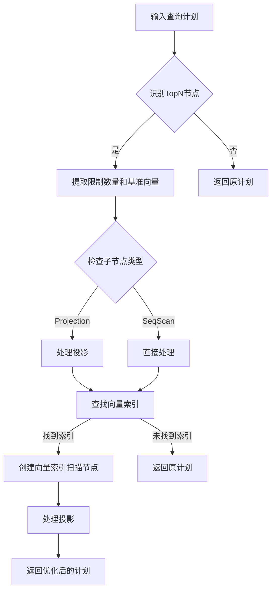

+++
date = '2024-11-10T19:42:02+08:00'
title = "匹配向量索引"
category = "技术"
tags = ["向量索引", "优化器"]
+++


# 匹配向量索引任务介绍概述


这个任务的目标是根据查询中的条件，判断是否可以将查询转换为向量索引扫描，并在可能的情况下使用该索引。通过这种方式，你可以显著提高向量最近邻查询的效率，避免全表扫描。

具体来说，你需要实现一个优化规则，该规则能够识别出需要执行**向量索引扫描**的SQL查询，并将这些查询转换成使用向量索引的执行计划。任务的关键部分是优化器（optimizer），你需要根据查询的结构和给定的索引类型选择合适的索引进行查询优化。

### 任务步骤：
1. **识别查询**：首先，优化器需要识别SQL查询中是否有需要使用向量索引的部分。查询通常会包含计算向量距离（如`<->`）的条件，这时候就可能需要使用索引扫描来替代全表扫描。
   
2. **转换为向量索引扫描**：当确认查询能使用向量索引时，优化器需要将查询计划转换为**向量索引扫描**。这个过程包括：
   - 查找查询中的**向量列**，通常是表中的第一个向量列。
   - 选择一个可用的索引（如HNSW或IVFFlat）来优化查询。
   - 将查询转换为一个新的查询计划节点，替代传统的全表扫描和排序操作。

3. **支持的查询类型**：你需要处理不同形式的查询，特别是带有`ORDER BY`和`LIMIT`子句的查询。例如，查询可能包含按向量距离排序并限制返回结果数量的操作，这些查询应转换为使用向量索引扫描。

4. **索引选择策略**：在优化器中，你需要实现一个策略来选择合适的索引。可以选择以下几种策略：
   - **空值**（默认）：选择第一个可用的向量索引。
   - **HNSW**：只匹配HNSW索引。
   - **IVFFlat**：只匹配IVFFlat索引。
   - **无索引**：不使用任何索引，进行精确的最近邻搜索。

### 处理的三种情况

优化器需要处理以下三种常见的查询结构，并根据情况选择使用向量索引扫描：

1. **情况1：TopN直接跟随SeqScan**
   ```text
   TopN { n=2, order_bys=[("Default", "l2_dist([1.000000,1.000000,1.000000], #0.0)")]}
     SeqScan { table=t1 }
   ```
   这种情况下，查询直接使用了`TopN`（即返回前`k`个结果），并且顺序扫描表。此时可以直接将`SeqScan`替换为向量索引扫描。

2. **情况2：TopN跟随Projection**
   ```text
   TopN { n=2, order_bys=[("Default", "l2_dist([1.000000,1.000000,1.000000], #0.0)")]}
     Projection { exprs=["#0.0", "l2_dist([1.000000,1.000000,1.000000], #0.0)"] }
       SeqScan { table=t1 }
   ```
   在这种情况下，`TopN`操作之后有一个`Projection`操作，需要对结果进行投影。优化器仍然可以将`SeqScan`替换为向量索引扫描，并在索引扫描后加上投影操作，以保持查询语义。

3. **情况3：TopN跟随Projection并且列顺序变换**
   ```text
   TopN { n=2, order_bys=[("Default", "l2_dist([1.000000,1.000000,1.000000], #0.1)")]}
     Projection { exprs=["#0.1", "#0.0"] }
       SeqScan { table=t1 }
   ```
   这种情况与情况2类似，但投影中列的顺序发生了变化，优化器需要正确地识别出列的映射，并在向量索引扫描后执行相应的投影。

### 索引选择策略
优化器会根据以下条件选择合适的向量索引：
- **未设置索引选择策略**：选择第一个可用的向量索引。
- **HNSW**：只匹配HNSW索引。
- **IVFFlat**：只匹配IVFFlat索引。
- **无索引**：不使用索引，进行精确的最近邻查询。

### 总结
本任务的核心是实现一个优化规则，通过分析查询结构来判断是否可以使用向量索引进行优化。通过匹配查询中的距离计算条件，优化器将选择合适的索引并转换查询执行计划，以提高向量最近邻查询的效率。


# 向量索引扫描优化器的实现

## 1. 概述

向量索引扫描优化器（Vector Index Scan Optimizer）是一个用于优化向量相似度搜索查询的组件。它能够将基于全表扫描的向量搜索转换为使用专门的向量索引进行搜索，从而显著提升查询性能。

## 2. 核心功能

### 2.1 索引匹配（MatchVectorIndex）
````cpp
auto MatchVectorIndex(const Catalog &catalog, 
                     table_oid_t table_oid, 
                     uint32_t col_idx, 
                     VectorExpressionType dist_fn,
                     std::string &vector_index_match_method) 
    -> const IndexInfo *
````

#### 功能描述
- 在给定表中查找合适的向量索引
- 支持多种向量距离度量方式
- 提供灵活的索引选择策略

#### 支持的索引类型
1. **HNSW（Hierarchical Navigable Small World）**
   - 高精度近似最近邻搜索
   - 适用于要求高精度的场景

2. **IVF-FLAT（Inverted File with Flat Storage）**
   - 中等精度的近似最近邻搜索
   - 适用于内存受限场景

#### 索引匹配策略
```cpp
if (vector_index_match_method.empty() || vector_index_match_method == "default") {
    // 使用第一个匹配的索引
} else if (vector_index_match_method == "hnsw") {
    // 强制使用HNSW索引
} else if (vector_index_match_method == "ivfflat") {
    // 强制使用IVF-FLAT索引
} else if (vector_index_match_method == "none") {
    // 不使用索引，执行顺序扫描
}
```

### 2.2 查询计划优化（OptimizeAsVectorIndexScan）
````cpp
auto OptimizeAsVectorIndexScan(const AbstractPlanNodeRef &plan) 
    -> AbstractPlanNodeRef
````

#### 支持的查询模式
1. **直接TopN模式**
```sql
SELECT * FROM images 
ORDER BY feature <-> ARRAY[1,2,3] LIMIT 5;
```

2. **带投影的TopN模式**
```sql
SELECT feature, distance(feature, ARRAY[1,2,3]) as dist 
FROM images 
ORDER BY dist LIMIT 5;
```

3. **带列重排的TopN模式**
```sql
SELECT url, feature, distance(feature, ARRAY[1,2,3]) as dist 
FROM images 
ORDER BY dist LIMIT 5;
```

#### 优化流程


## 3. 性能特征

### 3.1 时间复杂度
- 全表扫描：O(n)
- HNSW索引：O(log n)
- IVF-FLAT索引：O(sqrt(n))

### 3.2 空间复杂度
- HNSW索引：O(n * E)，E为每个节点的平均边数
- IVF-FLAT索引：O(n)

## 4. 使用示例

### 4.1 创建向量索引
```sql
-- 创建表
CREATE TABLE images (
    id INT,
    feature VECTOR(128),
    url TEXT
);

-- 创建HNSW索引
CREATE INDEX img_feature_hnsw ON images 
USING hnsw (feature vector_l2_ops) 
WITH (m = 16, ef_construction = 64);
```

### 4.2 查询示例
```sql
-- 基本向量搜索
SELECT * FROM images 
ORDER BY feature <-> ARRAY[...] 
LIMIT 5;

-- 带距离计算的搜索
SELECT *, 
       feature <-> ARRAY[...] as distance 
FROM images 
ORDER BY distance 
LIMIT 5;
```

## 5. 配置参数

### 5.1 HNSW索引参数
- `m`：每个节点的最大边数
- `ef_construction`：构建时的搜索范围
- `ef_search`：查询时的搜索范围

### 5.2 IVF-FLAT索引参数
- `nlist`：聚类中心数量
- `nprobe`：查询时检查的聚类数量
